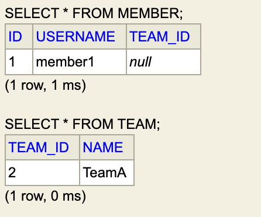

### 연관관계의 주인

- 양방향 매핑 규칙
  - 객체의 두 관계 중 하나를 연관관계의 주인으로 지정
  - 연관관계의 주인만이 외래 키를 관리(등록, 수정)
  - 주인이 아닌 쪽은 읽기만 가능
  - 주인은 mappedBy 속성 사용 X
  - 주인이 아니면 mappedBy 속성으로 주인 지정
  - **외래 키가 있는 곳을 주인으로 지정**


### 양방향 연관관계 매핑 시 주의할 점

- Team : Member (1:N인 관계)

```java
// Member.java
public class Member {

    @Id @GeneratedValue
    private Long id;

    @Column(name = "USERNAME")
    private String username;

    // 연관관계 매핑을 할 때 주의 : 외래키의 주인은 1:N 중 N에 해당하는 테이블의 컬럼
    @ManyToOne
    @JoinColumn(name = "TEAM_ID")
    private Team team;
}


// Team.java
public class Team {

    @Id @GeneratedValue
    @Column(name = "TEAM_ID")
    private Long id;
    private String name;

    @OneToMany(mappedBy = "team")
    private List<Member> members = new ArrayList<>();
}
```

```java
  // 저장
  Member member = new Member();
  member.setUsername("member1");
  em.persist(member);

  Team team = new Team();
  team.setName("TeamA");
  team.getMembers().add(member);			// 역방향 (주인이 아닌 방향)만 연관관계 설정
  em.persist(team);

  tx.commit();
```



- 역방향에만 연관관계를 설정하면 외래키 값이 null로 저장
- 현재 주인은 Member의 team이기 때문에 연관관계의 주인에 등록을 해줘야 함

```java
    // 저장
    Team team = new Team();
    team.setName("TeamA");
    em.persist(team);

    Member member = new Member();
    member.setUsername("member1");
    member.setTeam(team);				// 이부분이 포인트
    em.persist(member);

    tx.commit();
```


- 순수한 객체 관계를 고려하면 항상 양쪽 다 값을 입력해야 한다

  - ```java
        // 저장
        Team team = new Team();
        team.setName("TeamA");
        em.persist(team);
    
        Member member = new Member();
        member.setUsername("member1");
        member.setTeam(team);					// 값 세팅
        em.persist(member);
     
    //		team.getMembers().add(member);	// 값 세팅
    
    //		em.flush();
    //		em.clear();
    
        Team findTeam = em.find(Team.class, team.getId());		// 1차 캐시
        List<Member> members = findTeam.getMembers();
    
        for (Member m : members) {
            System.out.println("m = " + m.getUsername());
        }
    
        tx.commit();
    ```

  - 값을 가져올 때 영속성 컨텍스트에 있는 1차 캐시에서 값을 가져오기 때문에 team에선 member를 조회할 수 없게 됨

  - `team.getMembers().add(member)` 양쪽 값을 세팅해주거나

  -  `em.flush() , em.clear()` 로 영속성 컨텍스트를 초기화 후 db에서 조회해 와야 함

  - 참고

    - ```java
        // 연관관계 편의 메서드 (둘 중 하나 선택)
      
      // Member.java
        public void changeTeam(Team team) {
            this.team = team;
            team.getMembers().add(this);
        }
      
      // Team.java
          public void addMember(Member member) {
              member.setTeam(this);
              members.add(member);
          }
      ```


### 양방향 매핑 정리

* 단방향 매핑을 잘 하고 양방향은 필요할 때 추가