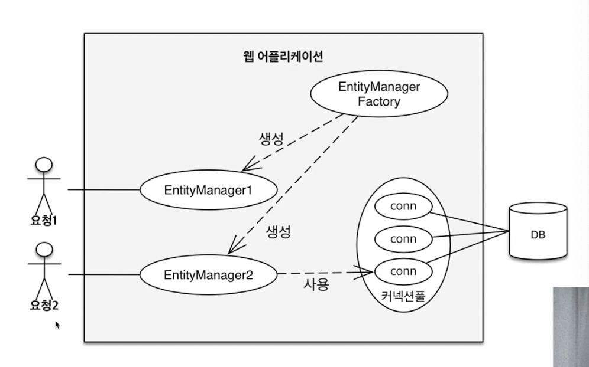
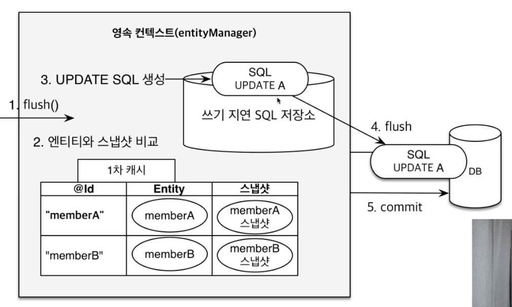
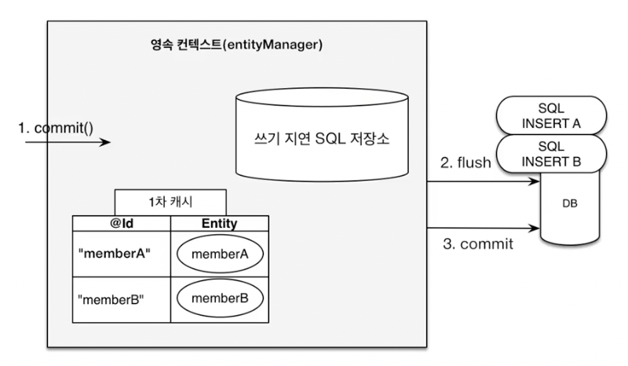

### 엔티티 매니저 팩토리와 엔티티 매니저

- 엔티티 매니저 팩토리는 애플리케이션 로딩 시점에 딱 하나만 만들어야함 + 쓰레드 간에 공유하면 안됨 사용하고 버려야함



- 엔티티 매니저 팩토리아 엔티티매니저를 생성하고 엔티티 매니저는 커넥션풀을 사용해서 DB에 접근


### 영속성 컨텍스트

- 엔티티를 영구 저장하는 환경

- 엔티티 매니저를 통해 영속성 컨텍스트에 접근

- 엔티티의 생명 주기

  - 비영속 : 영속성 컨텍스트와 전혀 관례가 없는 새로운 상태
  - 영속 : 영속성 컨텍스트에 관리되는 상태
  - 준영속 : 영속성 컨텍스트에 저장되었다가 분리된 상태
  - 삭제 : 삭제된 상태

  ```java
    EntityManager em = emf.createEntityManager();
  
    Member member = new Member();
    member.setId(1L);
    member.setName("Hello");	// 비영속 상태
    em.persist(member);			// 영속 상태
  	em.detach(member);		// 준영속 상태
  	em.remove(member);		// 삭제
  ```

- 웹 어플리케이션과 DB 사이에 중간 계층이 있다고 생각하면 됨

- 영속성 컨텍스트의 이점

  - 1차 캐시
    - id / entity 값으로 캐시에 저장함
    - 엔티티 매니저는 조회 시 캐시에 없으면 DB조회 수 1차 캐시에 저장
    - 1차 캐시에 저장된 이후로 엔티티 매니저는 캐시에서 조회
    - 사실 엔티티 매니저는 트랜잭션 단위로 만들기 때문에 성능에 큰 이점이 없음
    - 트랜잭션 종료 시 캐시는 모두 사라짐
  - 동일성 보장
  - 트랜잭션을 지원하는 쓰기 지연
  - 변경 감지(Dirty Checking)
    - 엔티티와 스냅샷을 비교함
    - update 쿼리를 따로 날리지 않아도 변경을 감지하여 db에 업데이트함
    - 
  - 지연 로딩


### 플러시

- 영속성 컨텍스트의 변경내용을 데이터베이스에 반영
- 변경 감지 후 수정된 엔티티를 쓰기 지연 SQL 저장소에 등록
- 쓰기 지연 SQL 저장소의 쿼리를 데이터베이스에 전송



```java
  Member member = new Member();
  member.setId(1L);
  member.setName("Hello");
  em.persist(member);

  em.flush();		// 쿼리를 강제로 호출할 수 있음
```

- flush를 하더라도 1차 캐시는 지워지지 않음
- db에 쿼리가 날아가지만 commit 전에 반영이 안됨
- 플러시 모드 옵션
  - FlushModeType.AUTH
    - 커밋이나 쿼리를 실행할 때 플러시(기본값)
  - FlushModeType.COMMIT
    - 커밋할 때만 플러시


### 준영속 상태

- 영속 상태의 엔티티가 영속성 컨텍스트에서 분리(detached)
- 영속성 컨텍스트가 제공하는 기능을 사용 못함
- 준영속 상태로 만드는법
  - em.detach(entity) : 특정 엔티티만 준영속 상태로 전환
  - em.clear() : 영속성 컨텍스트를 완전히 초기화
  - em.close() : 영속성 컨텍스트를 종료