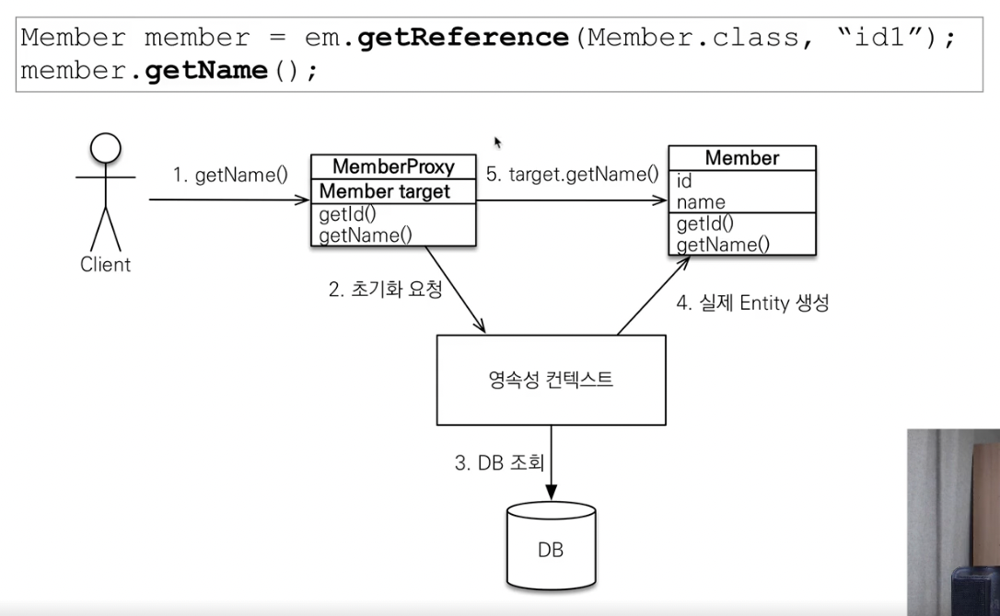

### 프록시 기초

- em.find() vs em.getReference()
  - em.find() : 데이터베이스를 통해 실제 엔티티 객체 조회
  - em.getReferenct() : 데이터베이스 조회를 미루는 가짜(프록시) 엔티티 객체 조회

### 프록시 특징

* 실제 클래스를 상속 받아서 만들어짐
* 실제 클래스와 겉 모양이 같음
* 프록시 객체는 실제 객체의 참조(target)를 보관
* 프록시 객체를 호출하면 프록시 객체는 실제 객체의 메소드 호출
* 

- **프록시 객체는 처음 사용할 때 한 번만 초기화**
- 프록시 객체를 초기화 할 때, 프록시 객체가 실제 엔티티로 바뀌는 것이 아니라, 프록시 객체를 통해서 실제 엔티티에 접근 가능한 것
- 프록시 객체는 원본 엔티티를 상속받기 때문에 타입 체크 시 주의해야함 (== 비교 X , instance of 사용)
- 영속성 컨텍스트에 찾은 엔티티가 이미 있으면 em.getReference()를 호출해도 실제 엔티티 반환
- 영속성 컨텍스트의 도움을 받을 수 없는 준영속 상태일 때, 프록시를 초기화하면 문제 발생

### 프록시 확인

- 프록시 인스턴스 초기화 여부 확인
  - PersistenceUnitUtil.isLoaded(Object entity)
- 프록시 클래스 확인 방법
  - entity.getClass().getName()
- 프록시 강제 초기화
  - Org.hibernate.Hibernate.initialize(entity);
  - 참고  : JPA표준은 강제 초기화 없음